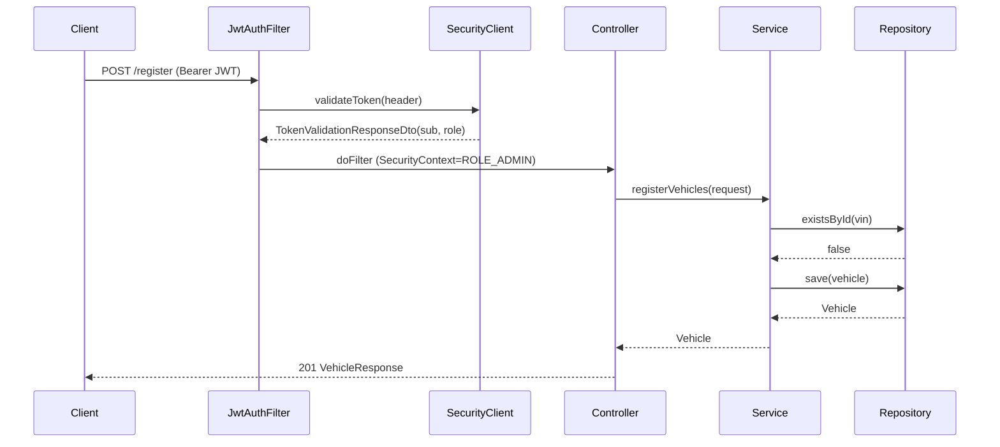

# Codebase Map
> Auto-generated by Cartographer for KT document generation.
> Subagent groups were seeded from graphify communities (Phase 0 graph).

## Project Info
- **Name:** registry-service
- **Group / Artifact:** com.vehicle / registry-service
- **Version:** 0.0.1-SNAPSHOT
- **Java Version:** 21
- **Spring Boot Version:** 3.5.14 (spring-boot-starter-parent)
- **Database:** H2 in-memory (`jdbc:h2:mem:vehicle-db;DB_CLOSE_DELAY=-1`), H2 console at `/h2-console`
- **Server Port:** default 8080 (not overridden in application.properties)
- **Base Package:** com.vehicle.registry_service
- **External dependency:** Auth/token-validation service at `http://localhost:8088/v1/public/auth/validate` (hardcoded in SecurityClient)

## Dependencies
| Dependency | Version | Purpose |
|---|---|---|
| spring-boot-starter-data-jpa | (managed 3.5.14) | JPA / Hibernate persistence |
| spring-boot-starter-web | (managed) | Spring MVC REST endpoints |
| spring-boot-starter-security | (managed) | Authentication / method security |
| spring-boot-starter-webflux | (managed) | WebClient (used as blocking HTTP client) |
| springdoc-openapi-starter-webmvc-ui | 2.8.16 | Swagger UI / OpenAPI docs |
| spring-boot-devtools | (managed, runtime) | Hot reload in dev |
| h2 | (managed, runtime) | In-memory database |
| lombok | (managed, optional) | Boilerplate reduction (@Data, @Slf4j, @RequiredArgsConstructor) |
| spring-boot-starter-test | (managed, test) | JUnit 5 / Mockito |
| spring-security-test | (managed, test) | @WithMockUser security testing |

**Build plugins:** spring-boot-maven-plugin (lombok excluded from repackage), maven-compiler-plugin (lombok annotation processor), jacoco-maven-plugin 0.8.11 (coverage; **excludes SecurityClient.class**), sonar-maven-plugin 3.8.0.2131.

## System Overview

```mermaid
flowchart TD
    Client[HTTP Client] -->|Bearer JWT| Filter[JwtAuthFilter]
    Filter -->|validateToken| SecClient[SecurityClient]
    SecClient --> ExtClient[ExternalApiClient]
    ExtClient -->|WebClient GET| Auth[(External Auth Service<br/>localhost:8088)]
    Filter -->|SecurityContext set| Chain[Spring Security Chain]
    Chain --> Ctrl[VehicleRegistrationController<br/>/api/v1/vehicles]
    Ctrl --> Svc[VehicleRegistrationService]
    Svc --> Repo[VehicleRegistrationRepository<br/>+ VehicleSpecification]
    Repo --> DB[(H2: vehicles table)]
    Ctrl -.exceptions.-> GEH[VehicleRegistrationGlobalExceptionHandler<br/>@RestControllerAdvice]
    Filter -.error JSON.-> ApiErr[ApiErrorResponse]
    GEH --> ApiErr
```

**Layered architecture:** Filter → Controller → Service → Repository/Specification → H2. Cross-cutting: security filter + external auth client, global exception advice, OpenAPI docs.

## Directory Structure
```
com.vehicle.registry_service
├── RegistryServiceApplication.java     # @SpringBootApplication entry point
├── controller/                         # REST layer (VehicleRegistrationController)
├── service/                            # Business logic (VehicleRegistrationService)
├── Repository/                         # Data access (note: capitalized package)
│   ├── VehicleRegistrationRepository.java   # JpaRepository + JpaSpecificationExecutor
│   └── spec/VehicleSpecification.java       # dynamic filter Specification builder
├── entity/                             # JPA entity (Vehicle → table "vehicles")
├── dto/                                # Request/response DTOs + ApiErrorResponse
├── exception/                          # 6 custom exceptions + global handler advice
├── filters/                            # JwtAuthFilter (OncePerRequestFilter)
├── configuration/                      # SecurityConfig, WebClientConfig, OpenApiConfig, ApiErrorExamples
├── client/                             # SecurityClient, ExternalApiClient (WebClient wrappers)
└── constants/                          # VehicleServiveConstants (sic)
```

## Feature Flows

### Feature: Vehicle Registration & Management
Base path: `/api/v1/vehicles` — all endpoints require an authenticated JWT (set by JwtAuthFilter) plus a role check via `@PreAuthorize`.

#### POST /api/v1/vehicles/register — Register a vehicle  (`hasRole('ADMIN')`)
```
registerVehicles(@Valid VehicleRegisterRequest, HttpServletRequest)
  → @Valid: vin @NotBlank+@Pattern(^VIN\d{5}$), model @NotBlank,
            ecuVersion @NotBlank+@Pattern(^v\d+\.\d+\.\d+$)   → 400 on violation
  → service.registerVehicles(request)
      → repository.existsById(vin)   → SELECT 1 FROM vehicles WHERE vin=?
          → if exists: throw DuplicateDataException → 409 Conflict
      → new Vehicle(vin, model, ecuVersion, now(), now())
      → repository.save(vehicle)     → INSERT INTO vehicles
  → map to VehicleResponse(vin, model, ecuVersion)
  → 201 Created
```

#### GET /api/v1/vehicles/{vin} — Get by VIN  (`hasAnyRole('ADMIN','SERVICE','VEHICLE')`)
```
findVehicleById(@PathVariable vin)
  → service.findVehicleById(vin)
      → repository.findById(vin).orElseThrow(DataNotFoundException)  → 404
  → map to VehicleResponse → 200 OK
```

#### PUT /api/v1/vehicles/{vin} — Update  (`hasRole('ADMIN')`)
```
updateVechicleDetails(@PathVariable vin, @Valid VehicleUpdateRequest)
  → @Valid: model @NotBlank, ecuVersion @NotBlank (NO @Pattern — see gotcha)
  → service.updateVechicleDetails(vin, request)
      → findVehicleById(vin)  → 404 if absent
      → setModel / setEcuVersion / setUpdatedAt(now())
      → repository.save(vehicle)  → UPDATE vehicles ... WHERE vin=?
  → map to VehicleResponse → 200 OK
```

#### DELETE /api/v1/vehicles/{vin} — Delete  (`hasRole('ADMIN')`)
```
deleteVehicle(@PathVariable vin)
  → service.deleteVehicle(vin)
      → findVehicleById(vin)  → 404 if absent
      → repository.delete(vehicle)  → DELETE FROM vehicles WHERE vin=?
  → 204 No Content
```

#### GET /api/v1/vehicles — List paginated + filtered  (`hasAnyRole('ADMIN','SERVICE')`)
```
listAllVehicles(vin?, model?, ecuVersion?, page=0, size=10 @Min(1),
                sort=createdAt, direction=ASC)
  → controller validation:
      direction.toUpperCase() ∈ {ASC,DESC}      else IllegalArgumentException → 400
      sort ∈ {id, createdAt, vin}               else IllegalArgumentException → 400
  → service.listAllVehicles(...)
      → Sort = DESC? desc : asc;  Pageable = PageRequest.of(page,size,sort)
      → spec = VehicleSpecification.withFilters(vin, model, ecuVersion):
            vin → exact equality (case-sensitive)
            model → LOWER(model) LIKE %lower(model)%   (case-insensitive)
            ecuVersion → ecuVersion LIKE %ecuVersion%   (case-sensitive)
            combined with AND; no filters → match all
      → repository.findAll(spec, pageable)  → SELECT ... WHERE ... ORDER BY ... LIMIT/OFFSET
  → stream content → List<VehicleResponse>
  → PaginatedResponseDto(message, data, page, size, totalElements, totalPages, last)
  → 200 OK
```

### Feature: Authentication (cross-cutting, runs before every /api/v1/** request)
```
HTTP Request → JwtAuthFilter.doFilterInternal
  → bypass if URI startsWith /swagger-ui, /v3/api-docs, /swagger-resources,
    /favicon.ico OR contains .well-known  → pass through
  → read "Authorization" header
      → null OR not "Bearer " → 401 {authError: "Authorization header is missing"}
  → SecurityClient.validateToken(authHeader)
      → ExternalApiClient.get("http://localhost:8088/v1/public/auth/validate",
                              headers, TokenValidationResponseDto.class)
          → WebClient GET, 5s Mono timeout, .block()
  → on success: UsernamePasswordAuthenticationToken(sub, null, [ROLE_<role>])
                → SecurityContextHolder.setAuthentication
  → filterChain.doFilter → SecurityFilterChain (/api/v1/** authenticated())
  → controller @PreAuthorize role check (403 if insufficient)
```
**Auth failure mapping (written directly by JwtAuthFilter):**
| Condition | Exception | HTTP |
|---|---|---|
| Missing/invalid header | — | 401 |
| Auth service 4xx/5xx | ClientErrorException | 401 ("Invalid or expired token detected") |
| Auth service unreachable | ServiceDownException | 503 |
| Auth service timeout (>5s) | TimeOutException | 504 ("Security service Timeout") |
| Any other error | (catch-all) | 500 |

## Module Guide

| Class | Layer | Purpose | Key methods | Depends on |
|---|---|---|---|---|
| RegistryServiceApplication | bootstrap | @SpringBootApplication entry point | main() | — |
| VehicleRegistrationController | controller | 5 REST endpoints under /api/v1/vehicles | register/find/update/delete/listAll | VehicleRegistrationService |
| VehicleRegistrationService | service | Vehicle CRUD business logic | registerVehicles, findVehicleById, updateVechicleDetails, deleteVehicle, listAllVehicles | VehicleRegistrationRepository |
| VehicleRegistrationRepository | repository | JpaRepository<Vehicle,String> + JpaSpecificationExecutor | (inherited) | Vehicle |
| VehicleSpecification | repository/spec | Builds dynamic filter Specification | withFilters(vin,model,ecuVersion) | Vehicle |
| Vehicle | entity | JPA @Entity → table "vehicles" | getters/setters (Lombok) | — |
| VehicleRegisterRequest | dto | Register payload (validated) | — | — |
| VehicleUpdateRequest | dto | Update payload (validated) | — | — |
| VehicleResponse | dto | Read projection (vin, model, ecuVersion) | — | — |
| PaginatedResponseDto<T> | dto | Pagination envelope | — | — |
| TokenValidationResponseDto | dto | Auth-service response (sub, role, iat, exp) | — | — |
| ApiErrorResponse | dto | Error envelope (status, message map, timeStamp) | @Builder | — |
| JwtAuthFilter | filter | Per-request JWT validation | doFilterInternal, buildErrorResponse | SecurityClient, ObjectMapper |
| SecurityConfig | config | SecurityFilterChain + @EnableMethodSecurity | securityFilterChain | SecurityClient, ObjectMapper |
| WebClientConfig | config | WebClient bean (method typo: webClinet) | webClinet() | — |
| OpenApiConfig | config | OpenAPI/Swagger metadata + bearerAuth scheme | vehicleRegistryOpenAPI() | — |
| ApiErrorExamples | config | Swagger example JSON constants | (constants) | — |
| SecurityClient | client | Calls external auth validate endpoint | validateToken | ExternalApiClient |
| ExternalApiClient | client | Generic blocking WebClient GET, 5s timeout | get(url,headers,type) | WebClient |
| VehicleRegistrationGlobalExceptionHandler | exception | @RestControllerAdvice, maps exceptions → ApiErrorResponse | 6 @ExceptionHandler methods | ApiErrorResponse |
| DataNotFoundException | exception | VIN not found (service) | → 404 | RuntimeException |
| DuplicateDataException | exception | Duplicate VIN (service) | → 409 | RuntimeException |
| ClientErrorException | exception | Auth 4xx/5xx (client) | → 401 in filter / 500 via handler | RuntimeException |
| ServiceDownException | exception | Auth unreachable (client) | → 503 in filter / 500 via handler | RuntimeException |
| TimeOutException | exception | Outbound timeout (client) | → 504 in filter / 500 via handler | RuntimeException |
| InternalAuthException | exception | Unexpected auth error (client) | → 500 | RuntimeException |
| VehicleServiveConstants | constants | App-wide string constants (sic) | (constants) | — |

## Exception → HTTP status (global handler)
| Exception | Handler | HTTP |
|---|---|---|
| DuplicateDataException | handleDuplicateVehicleException | 409 |
| DataNotFoundException | handleVehicleNotFoundException | 404 |
| MethodArgumentNotValidException | handleValidationErrors | 400 (field→message map) |
| HandlerMethodValidationException | handleHandlerMethodValidationException | 400 (param→message map) |
| IllegalArgumentException | handleIllegalArgumentException | 400 |
| Exception (and all client exceptions) | handleGenericException | 500 |

> Note: client-layer exceptions (ClientError/ServiceDown/TimeOut/InternalAuth) have **no dedicated @ExceptionHandler** — within the MVC layer they fall through to the generic 500 handler. Distinct 401/503/504 status codes only happen when JwtAuthFilter handles them directly during the filter stage.

## Data Flow (sequence — registration)



## Conventions
- Constructor injection via Lombok `@RequiredArgsConstructor`; logging via `@Slf4j`.
- DTOs use Lombok `@Data`/`@Builder`; entity uses `@Data` + `@AllArgsConstructor`/`@NoArgsConstructor`.
- Validation declared on request DTOs (`@NotBlank`, `@Pattern`) and triggered by `@Valid` in the controller.
- Centralized error handling via `@RestControllerAdvice`; uniform `ApiErrorResponse` envelope.
- Method-level authorization via `@PreAuthorize` (enabled by `@EnableMethodSecurity`).
- Dynamic queries via JPA Specification rather than custom `@Query` methods.
- String constants centralized in `VehicleServiveConstants`.

## Gotchas
1. **Hardcoded auth URL** `http://localhost:8088/...` in SecurityClient — breaks outside local env; should be externalized.
2. **VIN uniqueness is app-level only** — `Vehicle` has no `@Column(unique=true)`/`@Version`; concurrent inserts could race.
3. **Update validation gap** — `VehicleUpdateRequest.ecuVersion` lacks the `@Pattern` that `VehicleRegisterRequest` enforces.
4. **Client exceptions → 500** in MVC layer (no dedicated handlers); only the filter stage produces 401/503/504.
5. **`.well-known` bypass uses `contains()`** not `startsWith()` — a crafted path like `/api/v1/.well-known/x` skips auth.
6. **`anyRequest().permitAll()`** catch-all — anything outside `/api/v1/**` is open.
7. **Mono-level 5s timeout only** — no HTTP/TCP-level timeout configured on WebClient.
8. **Naming typos (faithful to source):** package `Repository` (capitalized), `VehicleServiveConstants`, method `updateVechicleDetails`, bean method `webClinet`, variable `authenticatioin`. Do NOT "fix" these in the KT doc — they are the real identifiers.
9. **`SORT_MODEL` constant exists but `"model"` is not in the controller's allowedSortFields** — sorting by model is not actually possible.
10. **`model` filter is case-insensitive, `ecuVersion` filter is case-sensitive** — inconsistent listing behavior.
11. **JaCoCo excludes SecurityClient** from coverage (pom.xml).

## Navigation Guide
- **Add a new REST endpoint:** add a method to `controller/VehicleRegistrationController.java` (+ `@PreAuthorize`), add business logic to `service/VehicleRegistrationService.java`, add DTOs under `dto/`.
- **Add a new database entity:** create `entity/<Name>.java` (`@Entity`/`@Table`), a repository under `Repository/`, and (if filtering) a Specification under `Repository/spec/`.
- **Modify authentication:** edit `filters/JwtAuthFilter.java` (token flow), `configuration/SecurityConfig.java` (chain/rules), `client/SecurityClient.java` (auth endpoint).
- **Add a new external API client:** add a method to `client/ExternalApiClient.java` or a new client; configure beans in `configuration/WebClientConfig.java`.
- **Add a new exception type:** create `exception/<Name>Exception.java` (extends RuntimeException) and add an `@ExceptionHandler` to `VehicleRegistrationGlobalExceptionHandler.java`.
- **Change error response shape:** edit `dto/ApiErrorResponse.java` and update `configuration/ApiErrorExamples.java` to match.
