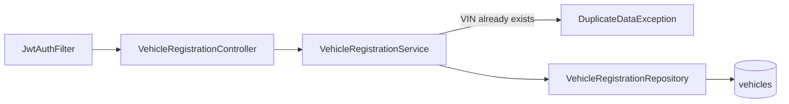
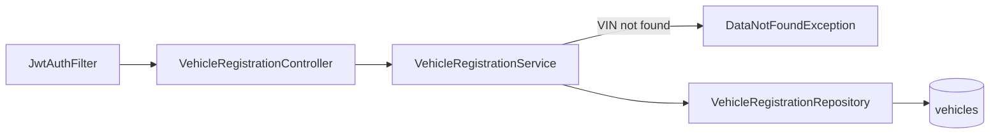
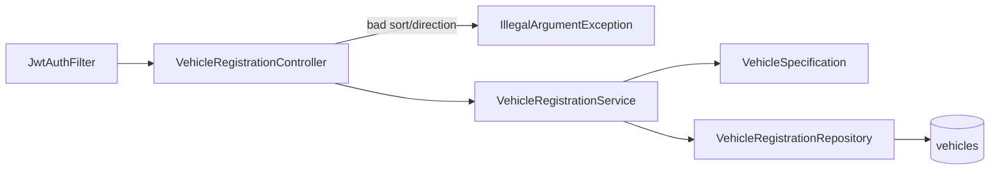

# registry-service — Knowledge Transfer Document

> Generated by KT Agent on 2026-06-23
> This document was auto-generated from actual source code analysis.
> Every claim is traceable to source files (graphify graph, CODEBASE_MAP.md, and the 7 docs/codebase/ documents).

---

## 🎯 1. Project Overview

`registry-service` is a Spring Boot REST microservice that manages **vehicle registration and metadata** (VIN, model, ECU firmware version). It exposes a CRUD + paginated-list API under `/api/v1/vehicles` and is intended for internal platform consumers (other services and admin tooling) that need to register, look up, update, and delete vehicle records.

Every request is authenticated by validating a Bearer JWT against an **external authentication service** (not an in-process secret), so this service trusts an upstream identity provider for token issuance and only enforces roles locally via `@PreAuthorize`. Persistence uses an in-memory **H2** database through Spring Data JPA. The codebase is a single-feature, classically layered Spring Boot application (Controller → Service → Repository), with cross-cutting security, outbound HTTP clients, centralized exception handling, and OpenAPI/Swagger documentation.

---

## 🛠️ 2. Tech Stack

| Technology | Version | Purpose |
|---|---|---|
| Java | 21 | Language/runtime (`pom.xml` `java.version`) |
| Spring Boot | 3.5.14 | Application framework (parent POM) |
| Maven | (wrapper) | Build & dependency management |
| spring-boot-starter-web | managed | Spring MVC REST endpoints |
| spring-boot-starter-data-jpa | managed | JPA / Hibernate persistence |
| spring-boot-starter-security | managed | Authentication & method security |
| spring-boot-starter-webflux | managed | `WebClient` (used as a **blocking** HTTP client) |
| springdoc-openapi-starter-webmvc-ui | 2.8.16 | Swagger UI / OpenAPI 3 docs |
| H2 Database | managed (runtime) | In-memory datastore (`vehicle-db`) |
| Lombok | managed (optional) | `@Data`, `@Slf4j`, `@RequiredArgsConstructor`, `@Builder` |
| spring-boot-devtools | managed (runtime) | Dev hot reload |
| spring-boot-starter-test | managed (test) | JUnit 5, Mockito, AssertJ |
| spring-security-test | managed (test) | `@WithMockUser` security testing |
| jacoco-maven-plugin | 0.8.11 | Coverage (excludes `SecurityClient.class`) |
| sonar-maven-plugin | 3.8.0.2131 | Static analysis (SonarQube) |

---

## 📁 3. Project Structure

Base package: `com.vehicle.registry_service`

```
src/main/java/com/vehicle/registry_service/
  RegistryServiceApplication.java   → @SpringBootApplication entry point
  controller/      → REST API layer (VehicleRegistrationController)
  service/         → Business logic layer (VehicleRegistrationService)
  Repository/      → Data access layer (VehicleRegistrationRepository)   [note: capital R]
    spec/          → Dynamic JPA Specification (VehicleSpecification)
  entity/          → JPA entities (Vehicle → table "vehicles")
  dto/             → Request/response DTOs + ApiErrorResponse
  client/          → External API clients (SecurityClient, ExternalApiClient)
  configuration/   → Spring config (SecurityConfig, WebClientConfig, OpenApiConfig, ApiErrorExamples)
  constants/       → Constant values (VehicleServiveConstants)            [note: misspelled]
  exception/       → Custom exceptions + global @RestControllerAdvice handler
  filters/         → Request filters (JwtAuthFilter)
src/main/resources/
  application.properties            → H2 + logging config
src/test/java/com/vehicle/registry_service/
  (6 test classes mirroring main packages)
```

> The graphify community detection grouped these into clusters that match the package layout exactly (Vehicle REST Controller, Vehicle Service Layer, Repository & Specification, Custom Exceptions, Global Exception Handler, JWT Auth Filter, Security Config, External API Client, OpenAPI Config, DTOs, Vehicle Entity, Application Entry Point).

---

## 🏗️ 4. Architecture

Classic layered Spring Boot architecture. The interactive graph is at `graphify-out/graph.html`.

```mermaid
flowchart TD
    Client[HTTP Client] -->|Bearer JWT| Filter[JwtAuthFilter]
    Filter -->|validateToken| SecClient[SecurityClient]
    SecClient --> ExtClient[ExternalApiClient]
    ExtClient -->|WebClient GET| Auth[(External Auth Service<br/>localhost:8088)]
    Filter -->|SecurityContext set| Chain[Spring Security Chain]
    Chain --> Ctrl[VehicleRegistrationController<br/>/api/v1/vehicles]
    Ctrl --> Svc[VehicleRegistrationService]
    Svc --> Repo[VehicleRegistrationRepository<br/>+ VehicleSpecification]
    Repo --> DB[(H2: vehicles table)]
    Ctrl -.exceptions.-> GEH[VehicleRegistrationGlobalExceptionHandler<br/>@RestControllerAdvice]
    Filter -.error JSON.-> ApiErr[ApiErrorResponse]
    GEH --> ApiErr
```

**Layer flow:** `HTTP Request → JwtAuthFilter → Spring Security chain (+ @PreAuthorize) → VehicleRegistrationController → VehicleRegistrationService → VehicleRegistrationRepository (+ VehicleSpecification) → H2`. Any exception thrown in the MVC layer is converted to an `ApiErrorResponse` by the global `@RestControllerAdvice`; auth failures during the filter stage are written directly by `JwtAuthFilter`.

- **External API calls (client/):** `SecurityClient` → `ExternalApiClient` → external auth service via `WebClient` (5s timeout, blocking `.block()`).
- **Security layer (configuration/ + filters/):** `SecurityConfig` builds the `SecurityFilterChain` and inserts `JwtAuthFilter` before `UsernamePasswordAuthenticationFilter`; `@EnableMethodSecurity` activates `@PreAuthorize`.
- **Exception handling (exception/):** `VehicleRegistrationGlobalExceptionHandler` (`@RestControllerAdvice`) maps exceptions to HTTP statuses.

---

## 🔑 5. Key Classes

The graphify **god nodes** (most-connected classes) are dominated by the test classes plus `ApiErrorResponse` — confirming `ApiErrorResponse` is the central shared DTO and the test suite is the most interconnected area.

### Controllers
| Class | Package | Layer | Purpose |
|---|---|---|---|
| VehicleRegistrationController | controller | Controller | 5 REST endpoints under `/api/v1/vehicles` |

### Services
| Class | Package | Layer | Purpose |
|---|---|---|---|
| VehicleRegistrationService | service | Service | Vehicle CRUD business logic |

### Repositories
| Class | Package | Layer | Purpose |
|---|---|---|---|
| VehicleRegistrationRepository | Repository | Repository | `JpaRepository<Vehicle,String>` + `JpaSpecificationExecutor` |
| VehicleSpecification | Repository.spec | Repository | Builds dynamic filter `Specification<Vehicle>` |

### Entities
| Class | Package | Layer | Purpose |
|---|---|---|---|
| Vehicle | entity | Entity | `@Entity` mapped to table `vehicles` |

### DTOs
| Class | Package | Layer | Purpose |
|---|---|---|---|
| VehicleRegisterRequest | dto | DTO | Register payload (validated) |
| VehicleUpdateRequest | dto | DTO | Update payload (validated) |
| VehicleResponse | dto | DTO | Read projection (vin, model, ecuVersion) |
| PaginatedResponseDto&lt;T&gt; | dto | DTO | Pagination envelope |
| TokenValidationResponseDto | dto | DTO | Auth-service response (sub, role, iat, exp) |
| ApiErrorResponse | dto | DTO | Standard error envelope (status, message map, timeStamp) |

### Clients
| Class | Package | Layer | Purpose |
|---|---|---|---|
| SecurityClient | client | Client | Calls external auth validate endpoint |
| ExternalApiClient | client | Client | Generic blocking `WebClient` GET, 5s timeout |

### Configuration
| Class | Package | Layer | Purpose |
|---|---|---|---|
| SecurityConfig | configuration | Config | `SecurityFilterChain` + `@EnableMethodSecurity` |
| WebClientConfig | configuration | Config | `WebClient` bean (`webClinet()` — sic) |
| OpenApiConfig | configuration | Config | OpenAPI metadata + `bearerAuth` scheme |
| ApiErrorExamples | configuration | Config | Swagger example JSON constants |

### Filters
| Class | Package | Layer | Purpose |
|---|---|---|---|
| JwtAuthFilter | filters | Filter | Per-request JWT validation (`OncePerRequestFilter`) |

### Exceptions
| Class | Package | Layer | Purpose |
|---|---|---|---|
| VehicleRegistrationGlobalExceptionHandler | exception | Advice | Maps exceptions → `ApiErrorResponse` |
| DataNotFoundException | exception | Exception | VIN not found → 404 |
| DuplicateDataException | exception | Exception | Duplicate VIN → 409 |
| ClientErrorException | exception | Exception | Auth 4xx/5xx (client) |
| ServiceDownException | exception | Exception | Auth unreachable (client) |
| TimeOutException | exception | Exception | Outbound timeout (client) |
| InternalAuthException | exception | Exception | Unexpected auth error (client) |

### Bootstrap
| Class | Package | Layer | Purpose |
|---|---|---|---|
| RegistryServiceApplication | (root) | Bootstrap | `@SpringBootApplication` entry point |

---

## 🌐 6. API Endpoints

Base path: `/api/v1/vehicles`. All endpoints require an authenticated JWT plus a role check.

| Method | Path | Controller | Handler Method | Purpose | Possible Error Codes |
|---|---|---|---|---|---|
| POST | /api/v1/vehicles/register | VehicleRegistrationController | registerVehicles | Register a new vehicle | 400 (validation), 409 (duplicate VIN), 401/403 (auth), 500 |
| GET | /api/v1/vehicles/{vin} | VehicleRegistrationController | findVehicleById | Get a vehicle by VIN | 404 (not found), 401/403 (auth), 500 |
| PUT | /api/v1/vehicles/{vin} | VehicleRegistrationController | updateVechicleDetails | Update model/ECU version | 400 (validation), 404 (not found), 401/403 (auth), 500 |
| DELETE | /api/v1/vehicles/{vin} | VehicleRegistrationController | deleteVehicle | Delete a vehicle | 404 (not found), 401/403 (auth), 500 |
| GET | /api/v1/vehicles | VehicleRegistrationController | listAllVehicles | Paginated + filtered list | 400 (bad sort field/direction or size<1), 401/403 (auth), 500 |

**Role guards (`@PreAuthorize`):**
- POST /register, PUT /{vin}, DELETE /{vin} → `hasRole('ADMIN')`
- GET /{vin} → `hasAnyRole('ADMIN','SERVICE','VEHICLE')`
- GET / (list) → `hasAnyRole('ADMIN','SERVICE')`

### Error Handling Summary

Global handler: `VehicleRegistrationGlobalExceptionHandler` (`@RestControllerAdvice`). Standard error shape is `ApiErrorResponse` = `{ status: int, message: { key → text }, timeStamp: String }`.

| Exception | Mapped HTTP Status | Handled By | Meaning |
|---|---|---|---|
| DuplicateDataException | 409 Conflict | handleDuplicateVehicleException | VIN already registered |
| DataNotFoundException | 404 Not Found | handleVehicleNotFoundException | VIN not found |
| MethodArgumentNotValidException | 400 Bad Request | handleValidationErrors | `@RequestBody` validation (field→message map) |
| HandlerMethodValidationException | 400 Bad Request | handleHandlerMethodValidationException | `@RequestParam`/`@PathVariable` validation |
| IllegalArgumentException | 400 Bad Request | handleIllegalArgumentException | Invalid sort field/direction |
| Exception (catch-all) | 500 Internal Server Error | handleGenericException | Any unmapped error |

> ⚠️ The client-layer exceptions (`ClientErrorException`, `ServiceDownException`, `TimeOutException`, `InternalAuthException`) have **no dedicated `@ExceptionHandler`** — inside the MVC layer they fall to the generic 500. Distinct 401/503/504 codes are produced only when `JwtAuthFilter` handles them during the filter stage (see Section 7). Flagged in Section 14.

---

## 🔐 7. Authentication and Security

**Mechanism:** Stateless Bearer-JWT authentication delegated to an external auth service.

**Flow:**
1. `JwtAuthFilter` (a `OncePerRequestFilter`) intercepts every request.
2. It bypasses auth for URIs starting with `/swagger-ui`, `/v3/api-docs`, `/swagger-resources`, `/favicon.ico`, or containing `.well-known`.
3. It reads the `Authorization` header; if missing or not `Bearer ` → **401** `{authError: "Authorization header is missing"}`.
4. It calls `SecurityClient.validateToken(authHeader)` → `ExternalApiClient.get(...)` → external auth service at `http://localhost:8088/v1/public/auth/validate`.
5. On success, it builds a `UsernamePasswordAuthenticationToken(sub, null, [ROLE_<role>])` and sets it on the `SecurityContextHolder`.
6. The Spring Security chain then enforces `/api/v1/** → authenticated()`, and `@PreAuthorize` enforces roles at the method.

**Auth failure mapping (written by `JwtAuthFilter`):**
| Condition | Exception | HTTP |
|---|---|---|
| Missing/invalid Authorization header | — | 401 |
| Auth service returns 4xx/5xx | ClientErrorException | 401 ("Invalid or expired token detected") |
| Auth service unreachable (network) | ServiceDownException | 503 |
| Auth service timeout (>5s) | TimeOutException | 504 ("Security service Timeout") |
| Any other error | (catch-all) | 500 |

**Configuration:** `SecurityConfig` disables CSRF, permits Swagger paths, requires authentication for `/api/v1/**`, and applies `anyRequest().permitAll()` to everything else. It enables method security with `@EnableMethodSecurity` and inserts `JwtAuthFilter` before `UsernamePasswordAuthenticationFilter`.

- **Protected:** all `/api/v1/**` endpoints (authenticated + role-checked).
- **Public:** Swagger/OpenAPI paths, and (by the catch-all) any path outside `/api/v1/**` — see Section 14.

**API docs security:** `OpenApiConfig` registers a `bearerAuth` HTTP bearer (JWT) scheme so Swagger UI shows an Authorize button.

---

## 🗄️ 8. Database Design

### Database Overview
- Database type: **H2 in-memory** (`jdbc:h2:mem:vehicle-db;DB_CLOSE_DELAY=-1`); console at `/h2-console`.
- ORM: Spring Data JPA / Hibernate.
- Connection: username `sa`, empty password (in-memory; not production-grade).

### Entities

#### Vehicle
- Database Table: `vehicles` (`@Table(name = "vehicles")`)
- Fields:

| Java Field | DB Column | Type | Constraints |
|---|---|---|---|
| vin | vin | String | `@Id` (primary key); no DB unique constraint beyond PK |
| model | model | String | none at DB level |
| ecuVersion | ecu_version (Hibernate default naming) | String | none at DB level |
| createdAt | created_at | LocalDateTime | set at registration |
| updatedAt | updated_at | LocalDateTime | refreshed on update |

- Relationships:

| Annotation | Target Entity | Cascade | Fetch Type |
|---|---|---|---|
| (none) | — | — | — |

> The entity has no `@Column(unique=true)` and no `@Version`. VIN uniqueness is enforced only in application code (`existsById`). Flagged in Section 14.

---

## ⚙️ 9. Configuration

| Property | Value | Purpose |
|---|---|---|
| spring.application.name | registry-service | Application name |
| server.port | 8080 (default; not set) | HTTP port |
| spring.datasource.url | jdbc:h2:mem:vehicle-db;DB_CLOSE_DELAY=-1 | H2 in-memory DB |
| spring.datasource.driver-class-name | org.h2.Driver | JDBC driver |
| spring.datasource.username | sa | DB user |
| spring.datasource.password | (empty) | DB password |
| spring.h2.console.enabled | true | Enable H2 web console |
| spring.h2.console.path | /h2-console | H2 console path |
| spring.jpa.show-sql | true | Log SQL |
| spring.jpa.properties.hibernate.format_sql | true | Pretty-print SQL |
| logging.level.root | INFO | Root log level |
| logging.level.com.vehicle.registry_service | DEBUG | App log level |
| logging.level.org.springframework | INFO | Framework log level |
| (hardcoded) External auth URL | http://localhost:8088/v1/public/auth/validate | Token validation endpoint (in `SecurityClient`, not config) |
| (hardcoded) Auth call timeout | 5 seconds | Reactor Mono timeout in `ExternalApiClient` |

---

## 🚀 10. How to Run

### Prerequisites
- Java 21 (from `pom.xml`)
- Maven
- No external DB needed (H2 is in-memory). An external **auth service** at `http://localhost:8088` is required for authenticated calls to succeed.

### Setup Steps
1. Clone the repository.
2. Review `src/main/resources/application.properties` (H2 is preconfigured; no changes needed for local run).
3. Run: `mvn clean install`
4. Verify: `BUILD SUCCESS` appears.
5. Run: `mvn spring-boot:run`
6. Verify: application starts on port 8080.
7. Test: open Swagger UI at `/swagger-ui.html` (public) or the H2 console at `/h2-console`. Calls to `/api/v1/vehicles/**` require a valid Bearer JWT validated by the auth service.

> Note: no Spring Boot Actuator dependency is present, so there is no `/actuator/health` endpoint.

---

## 💡 11. Business Logic Summary

### Feature: Vehicle Registration & Management

#### POST /api/v1/vehicles/register — Register a vehicle



```
VehicleRegistrationController.registerVehicles(@Valid VehicleRegisterRequest, HttpServletRequest)
  → @Valid: vin @NotBlank+@Pattern(^VIN\d{5}$), model @NotBlank,
            ecuVersion @NotBlank+@Pattern(^v\d+\.\d+\.\d+$)   → 400 on violation
  → VehicleRegistrationService.registerVehicles(request)
    → Business rule: repository.existsById(vin) == true → throw DuplicateDataException → 409
    → new Vehicle(vin, model, ecuVersion, now(), now())
    → VehicleRegistrationRepository.save(vehicle)  → INSERT INTO vehicles
  → map to VehicleResponse(vin, model, ecuVersion)
  → Returns 201 Created
```

#### GET /api/v1/vehicles/{vin} — Get vehicle by VIN



```
VehicleRegistrationController.findVehicleById(@PathVariable vin)
  → VehicleRegistrationService.findVehicleById(vin)
    → Business rule: repository.findById(vin).orElseThrow(DataNotFoundException) → 404
  → map to VehicleResponse
  → Returns 200 OK
```

#### PUT /api/v1/vehicles/{vin} — Update vehicle


```
VehicleRegistrationController.updateVechicleDetails(@PathVariable vin, @Valid VehicleUpdateRequest)
  → @Valid: model @NotBlank, ecuVersion @NotBlank (NO @Pattern — see Section 14)
  → VehicleRegistrationService.updateVechicleDetails(vin, request)
    → Business rule: findVehicleById(vin) → DataNotFoundException if absent → 404
    → setModel / setEcuVersion / setUpdatedAt(now())
    → VehicleRegistrationRepository.save(vehicle)  → UPDATE vehicles WHERE vin=?
  → map to VehicleResponse
  → Returns 200 OK
```

#### DELETE /api/v1/vehicles/{vin} — Delete vehicle


```
VehicleRegistrationController.deleteVehicle(@PathVariable vin)
  → VehicleRegistrationService.deleteVehicle(vin)
    → Business rule: findVehicleById(vin) → DataNotFoundException if absent → 404
    → VehicleRegistrationRepository.delete(vehicle)  → DELETE FROM vehicles WHERE vin=?
  → Returns 204 No Content
```

#### GET /api/v1/vehicles — List vehicles (paginated + filtered)



```
VehicleRegistrationController.listAllVehicles(vin?, model?, ecuVersion?, page=0,
                                              size=10 @Min(1), sort=createdAt, direction=ASC)
  → Business rule: direction.toUpperCase() ∈ {ASC,DESC}  else IllegalArgumentException → 400
  → Business rule: sort ∈ {id, createdAt, vin}           else IllegalArgumentException → 400
  → VehicleRegistrationService.listAllVehicles(...)
    → Sort = DESC ? descending : ascending; Pageable = PageRequest.of(page,size,sort)
    → VehicleSpecification.withFilters(vin, model, ecuVersion):
        vin        → builder.equal (exact, case-sensitive)
        model      → LOWER(model) LIKE %lower(model)%   (case-insensitive)
        ecuVersion → ecuVersion LIKE %ecuVersion%        (case-sensitive)
        combined with AND; no filters → match all
    → VehicleRegistrationRepository.findAll(spec, pageable)  → SELECT ... WHERE ... ORDER BY ... LIMIT/OFFSET
  → stream content → List<VehicleResponse>
  → PaginatedResponseDto(message, data, page, size, totalElements, totalPages, last)
  → Returns 200 OK
```

---

## 🏛️ 12. Architecture Decisions

- **Layered architecture (Controller/Service/Repository):** clear separation of web, business, and data concerns; organized by technical layer (single feature).
- **DTO pattern:** request/response DTOs (`VehicleRegisterRequest`, `VehicleUpdateRequest`, `VehicleResponse`, `PaginatedResponseDto`) decouple the API from the JPA entity; `VehicleResponse` deliberately omits audit timestamps.
- **Repository + Specification:** dynamic, optional filters via `VehicleSpecification` instead of a proliferation of custom query methods.
- **Centralized exception handling:** one `@RestControllerAdvice` produces a uniform `ApiErrorResponse` envelope.
- **Transaction management:** no service-level `@Transactional`; relies on Spring Data per-method transactions. `[ASK TEAM]` whether explicit service transactions are desired.
- **Constructor injection + Lombok:** `@RequiredArgsConstructor` + `@Slf4j` throughout.
- **Method security:** `@EnableMethodSecurity` + `@PreAuthorize` for role enforcement.
- **Naming conventions:** PascalCase classes, camelCase methods, UPPER_SNAKE_CASE constants. Several identifiers carry typos (`Repository` package, `VehicleServiveConstants`, `updateVechicleDetails`, `webClinet`, `authenticatioin`) — preserved as the real identifiers.

---

## ✅ 13. New Developer Checklist

### Setup Checklist
- [ ] Clone the repository
- [ ] Install Java 21
- [ ] Install Maven
- [ ] No DB setup needed (in-memory H2); ensure the external auth service at `http://localhost:8088` is reachable for authenticated calls
- [ ] Run `mvn clean install` and verify `BUILD SUCCESS`
- [ ] Start with `mvn spring-boot:run` and verify port 8080
- [ ] Open `/swagger-ui.html` (public) to explore the API

### Understanding Checklist
- [ ] Read this entire KT document
- [ ] Open `docs/CODEBASE_MAP.md` for the full architecture map and feature flows
- [ ] Trace one complete feature flow (e.g. POST /register) in the source
- [ ] Understand the `Vehicle` schema from Section 8
- [ ] Review all API endpoints from Section 6
- [ ] Review the authentication flow from Section 7

### Adding New Features (from CODEBASE_MAP.md Navigation Guide)
- [ ] **New endpoint:** add a method to `controller/VehicleRegistrationController.java` (+ `@PreAuthorize`), business logic in `service/VehicleRegistrationService.java`, DTOs under `dto/`
- [ ] **New entity:** create `entity/<Name>.java` (`@Entity`/`@Table`), a repository under `Repository/`, and (if filtering) a Specification under `Repository/spec/`
- [ ] **New service:** add a `@Service` class; inject the repository via `@RequiredArgsConstructor`
- [ ] **New external API client:** add to `client/ExternalApiClient.java` (or a new client); configure beans in `configuration/WebClientConfig.java`
- [ ] **New exception type:** create `exception/<Name>Exception.java` (extends `RuntimeException`) and add an `@ExceptionHandler` in `VehicleRegistrationGlobalExceptionHandler.java`

---

## ⚠️ 14. Flagged Items — Needs Human Review

| Item | Source | Why Flagged | Action Needed |
|---|---|---|---|
| Hardcoded external auth URL `http://localhost:8088/...` | CONCERNS / SecurityClient.java:20 | Breaks in non-local environments; not configurable | Externalize to config/env per environment |
| Client exceptions → 500 in MVC | CODEBASE_MAP / exception handler | ClientError/ServiceDown/TimeOut/InternalAuth have no dedicated MVC handler; only filter stage yields 401/503/504 | Decide whether MVC should map them to distinct codes |
| Update validation gap | CONCERNS / VehicleUpdateRequest.java | `ecuVersion` lacks the `@Pattern` enforced on register | Add `@Pattern` if version format must hold on update |
| VIN uniqueness app-level only | CONCERNS / Vehicle.java | No `@Column(unique=true)`/`@Version`; race condition under concurrency | Add DB unique constraint / optimistic locking |
| `.well-known` bypass uses `contains()` | CONCERNS / JwtAuthFilter.java:41 | Crafted path like `/api/v1/.well-known/x` skips auth | Change to `startsWith()` or tighten matching |
| `anyRequest().permitAll()` catch-all | CONCERNS / SecurityConfig.java:33 | Any path outside `/api/v1/**` is unauthenticated | Confirm intended; consider `denyAll()` default |
| No HTTP/TCP-level timeout on WebClient | CONCERNS / WebClientConfig.java | Only a 5s Mono timeout; TCP-connect hang may not be bounded | Configure `HttpClient` response/connect timeout |
| No retry / circuit breaker | CONCERNS / ExternalApiClient.java | Transient auth blips fail requests outright | Consider resilience (retry/circuit breaker) |
| Token-validation response logged at INFO | CONCERNS / SecurityClient.java:33 | Possible `sub`/`role` leakage into logs | Reduce log level / redact |
| `SORT_MODEL` constant unused | CODEBASE_MAP / controller:192 | `"model"` not in allowedSortFields → cannot sort by model | Remove constant or add to allowlist |
| `model` vs `ecuVersion` filter case-sensitivity | CODEBASE_MAP / VehicleSpecification.java | `model` case-insensitive, `ecuVersion` case-sensitive | Make filtering consistent |
| No `@Transactional` in service | ARCHITECTURE | No service-level atomicity boundary | Confirm transaction strategy |
| JaCoCo excludes `SecurityClient` | TESTING / pom.xml:144-148 | Coverage blind spot on a security component | Confirm intentional |
| No E2E tests; controller slice disables auth filter | TESTING | Auth filter not exercised end-to-end | Add integration coverage if needed |
| Naming typos in public surface | CONVENTIONS | `Repository` pkg, `VehicleServiveConstants`, `updateVechicleDetails`, `webClinet`, `authenticatioin` | Decide whether to rename (breaking) or keep |
| [ASK USER] Production auth URL & how to externalize | CONCERNS | Intent-dependent | Team to specify |
| [ASK USER] Production database (replacing H2) | CONCERNS | Intent-dependent | Team to specify |
| [ASK USER] Should client exceptions surface distinct MVC codes | CONCERNS | Intent-dependent | Team to decide |
| [ASK USER] Target test-coverage threshold for CI | CONCERNS | Intent-dependent | Team to decide |

> Validation note: All three upstream phases (graphify, cartographer, acquire-codebase-knowledge) passed their doublecheck gates with **RESULT: PASS**. No structural drift or fabricated symbols were found; the items above are real source characteristics and team-intent questions, not documentation errors.
